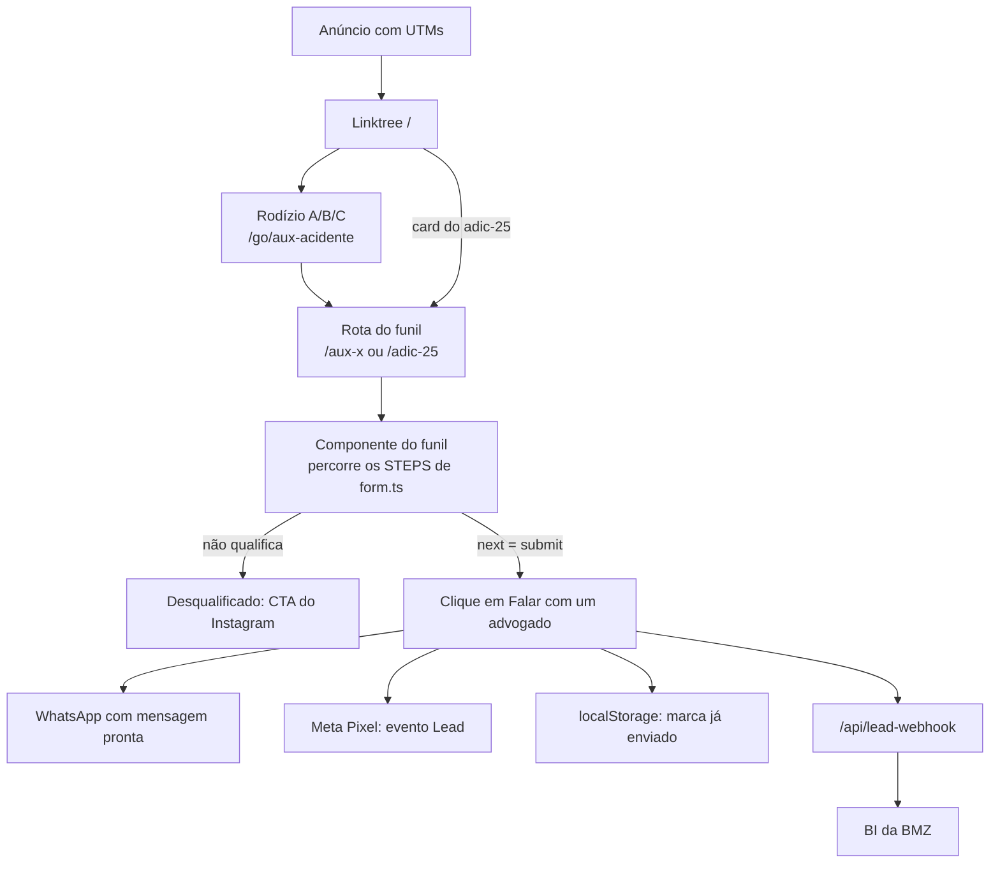

# Formulários BMZ: arquitetura e guia de novos funis

Atualizado em 06/10/2026

## Visão geral

O form.bmzadvogados.com qualifica leads jurídicos com funis de perguntas e, no final, abre o WhatsApp do escritório com a mensagem já escrita. No mesmo clique, o lead também é enviado ao BI. Cada produto (oferta) é um funil isolado: mexer em um não quebra o outro.

- **Repositório:** [bmztech/form-previdenci-rio](https://github.com/bmztech/form-previdenci-rio). `develop` é desenvolvimento, `main` é produção.
- **Stack:** Next.js 16 (App Router), React 19, Tailwind 4, TypeScript, Vitest.
- **Hospedagem:** Hostinger, um único processo Node (`npm run build` + `npm start`).
- **Sem banco de dados.** O estado fica no navegador do lead (UTMs e "já enviei") e num contador em memória do servidor, usado só pelo rodízio A/B/C.

| Rota | O que é | Destino do WhatsApp |
| --- | --- | --- |
| `/` | Linktree com um card por oferta. Repassa as UTMs ao destino. | não se aplica |
| `/go/aux-acidente` | Sem tela. Faz o rodízio A/B/C e redireciona com as UTMs. | não se aplica |
| `/aux-a`, `/aux-b`, `/aux-c` | Funil Auxílio-acidente. Mesmo funil, só muda o número. | `WHATSAPP_NUMBERS.a/b/c` |
| `/adic-25` | Funil Adicional de 25% | `WHATSAPP_NUMBER_ADIC25` |
| `/api/lead-webhook` | Proxy servidor que repassa o lead ao BI | não se aplica |

O card "Previdenciário" do linktree aponta para previdenciario.bmzadvogados.adv.br. Esse site é outro projeto, no repo `form-prev-mql-kommo` (Vite), com deploy próprio na Hostinger.

## Arquitetura

Um componente de funil (o "motor") executa uma lista de perguntas declarada em `form.ts`. No final, `whatsapp.ts` monta o link `wa.me` com a mensagem. O repo cresce por **cópia guiada**: cada produto tem sua pasta e seu componente, e só o que é genérico de verdade é compartilhado.



O lead pode entrar pelo linktree ou direto na rota do funil. Desqualificado, ele sai para o Instagram. Qualificado, um único clique dispara as quatro saídas da última linha.

```
src/
  app/
    page.tsx                  linktree (rota /)
    aux-a|aux-b|aux-c/page.tsx  funil auxílio-acidente, um por unidade
    adic-25/page.tsx          funil adicional de 25%
    go/aux-acidente/route.ts  rodízio A/B/C (redirect 307)
    api/lead-webhook/route.ts proxy do lead para o BI
    layout.tsx, globals.css   casca visual + Meta Pixel
  components/
    Funnel.tsx                motor + telas do auxílio-acidente
    FunnelAdic25.tsx          motor + telas do adicional de 25%
    Linktree.tsx, MetaPixel.tsx
  lib/
    aux-acidente/             form.ts, config.ts, whatsapp.ts, rotation.ts, testes
    adic25/                   form.ts, config.ts, whatsapp.ts, testes
    linktree/config.ts        cards da rota /
    lead-webhook.ts           payload + envio ao BI (compartilhado)
    tracking/                 utm.ts, phone.ts, links.ts (compartilhado)
    submission/status.ts      "já enviei" por grupo (compartilhado)
    meta/pixel.ts             Meta Pixel (compartilhado)
    site/config.ts            Instagram e site institucional (compartilhado)
```

### Os três arquivos de um módulo

| Arquivo | Responsabilidade | O que você edita nele |
| --- | --- | --- |
| `lib/<funil>/form.ts` | Perguntas, opções e ramificação (`STEPS`), mais as funções utilitárias que o componente usa | Texto de pergunta, opção nova, regra de desqualificação |
| `lib/<funil>/config.ts` | Número(s) de WhatsApp do funil | Troca de número |
| `lib/<funil>/whatsapp.ts` | `buildHeadline` (resumo do caso), `buildMessage` (linhas `Rótulo: valor` + bloco de origem) e `buildWhatsAppUrl` | Formato da mensagem |
| `components/Funnel<Nome>.tsx` | Máquina de telas, barra de progresso, atalhos de teclado e os textos das telas Intro, Desqualificado, Final e Já enviado | Textos de tela, grupo de envio |
| `app/<rota>/page.tsx` | Rota que renderiza o componente e define o metadata | Título, descrição, indexação |

### O formato de um step

```ts
type Step = {
  id: string;
  summaryLabel: string;      // rótulo na mensagem do WhatsApp
  counted?: boolean;         // false = não conta na barra de progresso
  hideInSummary?: boolean;   // true = não vira linha na mensagem
} & (
  | { kind: "text" | "phone"; question; placeholder; next: string }
  | { kind: "choice"; question; options: Choice[]; next: string | ((value) => string) }
  | { kind: "info"; message; buttonLabel?; next: string }   // só no adic25
);
```

- **`next` como texto** leva sempre ao mesmo step. **`next` como função** recebe a resposta e decide o próximo id. Toda a lógica condicional mora aí.
- **Dois ids são reservados.** `"submit"` encerra o funil e monta o WhatsApp. `"disqualified"` mostra a tela de desqualificação.
- **`question` pode ser função** de `answers` para citar uma resposta anterior, por exemplo na confirmação do adic25.
- **`Choice.phrase`** é a opção escrita para caber numa frase, como "do braço ou mão". Sem ele, o sistema usa a label em minúsculas.
- **`value` é interno** e vai para o BI em `respostas`. **`label`** é o que aparece na tela e na mensagem.

### Telas do motor

O componente alterna entre quatro telas: `intro`, `question`, `disqualified` e `done`. Se o navegador já enviou aquele grupo de formulário, a `intro` vira a tela "Já recebemos suas informações". O histórico de steps alimenta o botão Voltar e a barra de progresso.

A navegação para o WhatsApp acontece só por clique real no botão "Falar com um advogado agora". Esse clique abre o app nativo no celular e dispara, juntos, o evento `Lead` do Meta Pixel, a marca de "já enviado" e o envio ao BI.

## Lógica de cada funil

### Auxílio-acidente (`/aux-a`, `/aux-b`, `/aux-c`)

Qualifica quem sofreu acidente com sequela permanente e tinha qualidade de segurado. Os arquivos são `lib/aux-acidente/*` e `components/Funnel.tsx`. O grupo de envio é `aux-acidente`, compartilhado pelas três rotas.

| Step (`id`) | Tipo | Pergunta | Regra de `next` |
| --- | --- | --- | --- |
| `nome` | text | Qual é o seu nome? | `sequela` |
| `sequela` | choice | Sofreu acidente e ficou com sequela permanente? | `sim` vai para `vinculo`. `nao` desqualifica. |
| `vinculo` | choice | Situação de trabalho na época: carteira, agricultor, MEI/autônomo, desempregado | Carteira e agricultor vão para `inss`. MEI e desempregado vão para `carteiraAnterior`. |
| `carteiraAnterior` | choice | Fazia mais de um ano sem carteira assinada? | `sim` desqualifica. `nao` vai para `inss`. |
| `inss` | choice | Buscou o INSS? Afastado, não busquei, negado | `whatsapp` |
| `whatsapp` | phone | Qual seu WhatsApp? | `regiao` |
| `regiao` | choice | Parte do corpo: braço, perna, ombro, visão, cabeça, costas, outra | Cabeça e costas desqualificam (`REGIOES_DESQUALIFICANTES`). O resto vai para `lesao`. |
| `lesao` | text | Qual é a sua lesão na região {região}? | `submit` |

- **Barra de progresso:** o caminho tem 7 ou 8 perguntas, conforme o `vinculo`. Por isso `Funnel.tsx` usa `pathTotal(answers)`. Se uma ramificação nova mudar o tamanho do caminho, atualize essa função.
- **Cabeçalho da mensagem:** `Caso: {lesão} na região {phrase da região}`. A lesão tem `hideInSummary` porque já aparece ali.
- **Label "Outra região":** a automação do WhatsApp usa esse texto para reconhecer o caminho. Não renomeie sem avisar quem mantém o fluxo.
- **Voltar da desqualificação:** neste funil, o lead pode voltar da tela de desqualificado para a última pergunta.
- **Rodízio A/B/C:** o card do linktree aponta para `/go/aux-acidente`. Cada clique real avança uma posição da fila (A, B, C, A…) e redireciona para a rota da unidade. Um `HEAD` não avança a fila. O contador fica em memória e volta para A a cada deploy ou reinício.

### Adicional de 25% (`/adic-25`)

Qualifica aposentados por invalidez que recebem 13º. Os arquivos são `lib/adic25/*` e `components/FunnelAdic25.tsx`. O grupo de envio é `adic25`.

| Step (`id`) | Tipo | Pergunta | Regra de `next` |
| --- | --- | --- | --- |
| `nome` | text | Qual é o seu nome? | `telefone` |
| `telefone` | phone | Qual seu WhatsApp? | `avisoQualificacao` |
| `avisoQualificacao` | info | Aviso de que virão perguntas de qualificação. Não conta no progresso. | `beneficio` |
| `beneficio` | choice | Você recebe: invalidez, BPC/LOAS, aposentadoria normal | Invalidez vai para `decimo13`. As outras vão para `confirmaBeneficio`. |
| `confirmaBeneficio` | choice | Só pra confirmar: você recebe {resposta}? | `sim` desqualifica. `nao` volta para `beneficio`. |
| `decimo13` | choice | Você recebe décimo terceiro? | `sim` vai para `motivo`. `nao` vai para `confirmaDecimo13`. |
| `confirmaDecimo13` | choice | Só pra confirmar: você não recebe 13º? | `sim` desqualifica. `nao` volta para `decimo13`. |
| `motivo` | text | Motivo da aposentadoria por invalidez | `submit` |

- **Padrão pergunta e confirmação:** respostas que desqualificam passam por uma tela de confirmação. Isso reduz desqualificação por clique errado. As confirmações têm `counted: false` e `hideInSummary: true`.
- **Texto da desqualificação varia:** `disqualifyMessage(answers)` escolhe o texto conforme a confirmação que desqualificou.
- **Sem voltar depois de desqualificar:** neste funil o botão Voltar some na tela de desqualificado.
- **Barra de progresso:** usa a constante `TOTAL_QUESTIONS`, porque nenhum ramo muda o tamanho do caminho.
- **Cabeçalho da mensagem:** `Caso: adicional de 25% — motivo da invalidez: {motivo}`.
- **Metadata pendente:** o título e a descrição em `app/adic-25/page.tsx` ainda são `[placeholder]`.

### Exemplo de mensagem gerada

```
Caso: fratura que não consolidou na região do braço ou mão

Nome: Carlos Henrique Alves
Sequela: Sim, hoje tenho dificuldade para trabalhar como antes
Vínculo: Era MEI ou Autônomo
Mais de 1 ano sem carteira assinada: Não
INSS: Fui ao INSS mas fui negado
WhatsApp: (41) 99987-1234
Região: Braço ou mão

— origem —
landing_page: https://form.bmzadvogados.com/aux-b
utm_source: google
utm_medium: cpc
utm_campaign: inss_acidente
```

Só entram as perguntas que o lead viu de fato e que não têm `hideInSummary`. A ordem segue o array `STEPS`.

## Integrações

Todas as integrações ficam em `src/lib/` fora das pastas dos funis. Um funil novo só precisa chamá-las, sem duplicar código.

### Webhook do BI

No clique final, o navegador posta o lead em `/api/lead-webhook`, na mesma origem. A rota repassa ao BI de servidor para servidor. Assim não há CORS e o token não aparece no código do cliente.

| Campo do payload | Conteúdo |
| --- | --- |
| `form` | Grupo do funil (`FORM_GROUP`), como `aux-acidente` ou `adic25` |
| `pagina` | URL completa no momento do clique |
| `clicadoEm` | Data e hora do clique, em ISO 8601 |
| `nome` | Resposta do step `nome` |
| `telefone` | Telefone do lead, só dígitos (`phoneDigits`) |
| `whatsappDestino` | Número BMZ que recebe a mensagem |
| `mensagem` | Texto completo que o `wa.me` abre |
| `respostas` | Respostas cruas, com o `value` de cada step por `id` |
| `tracking` | UTMs, fbclid, gclid, referrer e landing\_page |

- **Dispara e esquece:** `sendLeadWebhook` usa `keepalive` e ignora qualquer falha. O envio ao BI nunca pode impedir a abertura do WhatsApp.
- **Sem reenvio:** o `leadReported` no componente impede um segundo envio se o lead voltar e clicar de novo.
- **Telefone com outro id:** o aux-acidente lê `answers.whatsapp` e o adic25 lê `answers.telefone`. Num funil novo, aponte `phoneDigits` para o id certo.
- **Configuração:** `LEAD_WEBHOOK_URL` e `LEAD_WEBHOOK_TOKEN`. O token vai no header `X-Webhook-Token` e também em `?token=`. O timeout é de 8 segundos.
- **Fallback fixo no código:** a rota tem um fallback com URL e token fixos (commit `0e9ca9e`), hoje presente na `main` e na `develop`. Os logs de 05/10 já mostram "usando env". O próximo passo é rotacionar o token vazado e remover o fallback.

### Meta Pixel

O pixel `1289395722733398` é montado uma vez em `layout.tsx` e cobre todas as rotas.

| Evento | Quando dispara |
| --- | --- |
| `PageView` | Toda carga de página |
| `Lead` | Clique em "Falar com um advogado agora" (`trackLead()`) |

O `Lead` não dispara para quem foi desqualificado nem para quem abandonou o funil.

### UTMs e rastreamento

- **Parâmetros capturados:** `TRACKING_PARAMS` em `tracking/utm.ts` lista `utm_source`, `utm_medium`, `utm_campaign`, `utm_content`, `utm_term`, `fbclid` e `gclid`. Um parâmetro novo entra nessa lista e passa a valer para todos os funis.
- **Persistência:** `readTracking()` junta a URL com o que está no `sessionStorage` (`bmz_tracking`). Assim as UTMs sobrevivem a um reload no meio do funil. O `referrer` e a `landing_page` são gravados só na primeira visita da sessão.
- **Propagação:** o linktree e o rodízio repassam as UTMs ao destino com `buildTrackedHref`. Parâmetros fora da lista são descartados.

### "Já enviei" por grupo

`submission/status.ts` grava `bmz_submitted_<grupo>` no `localStorage` no clique final. Na próxima visita, a `intro` desse grupo vira a tela de agradecimento. As rotas `/aux-a`, `/aux-b` e `/aux-c` dividem o mesmo grupo. Um funil novo ganha grupo próprio, salvo quando for a mesma oferta com outra origem de tráfego.

## Como criar um novo módulo (produto)

Um produto novo é uma cópia do `adic25`, que é o exemplo mais completo, com as perguntas trocadas. Não crie um componente genérico parametrizável: o repo escolheu isolar cada funil. No Claude Code, a skill `novo-funil` executa este roteiro.

### Antes de escrever código, reúna com o time de negócio

- [ ] **Slug** curto para pasta e rota, como `revisao-vida-toda`, e o nome em PascalCase para o componente, como `RevisaoVidaToda`
- [ ] **Fluxo de perguntas** com opções e em quais respostas o lead é desqualificado
- [ ] **Número de WhatsApp** de destino, só dígitos com 55 e DDD
- [ ] **Textos das telas:** headline da intro, desqualificação (um texto por motivo, se houver mais de um) e tela final
- [ ] **Card no linktree:** se o produto aparece na rota `/` e se precisa de rodízio entre unidades

### Passos

1. **Crie a pasta** `src/lib/<slug>/`.
2. **Crie `form.ts`** copiando `lib/adic25/form.ts`. Reescreva o array `STEPS` e o `FIRST_STEP`. Mantenha as funções exportadas (`stepById`, `resolveNext`, `labelFor`, `phraseFor`, `answerLabel`, `questionOf`, `TOTAL_QUESTIONS`), porque o componente depende delas.
3. **Crie `config.ts`** só com o número:

   ```ts
   export const WHATSAPP_NUMBER_<SLUG> = "55DDXXXXXXXXX";
   ```
4. **Crie `whatsapp.ts`** copiando `lib/adic25/whatsapp.ts`. Reescreva `buildHeadline` e troque o número padrão de `buildWhatsAppUrl`. O `buildMessage` normalmente fica igual.
5. **Registre o grupo** novo no tipo `FormGroup` em `lib/submission/status.ts`:

   ```ts
   export type FormGroup = "aux-acidente" | "adic25" | "<slug>";
   ```
6. **Crie o componente** `components/Funnel<Nome>.tsx` copiando `FunnelAdic25.tsx`:
   1. Troque os imports para `@/lib/<slug>/form`, `/config` e `/whatsapp`.
   2. Mude `FORM_GROUP` para o grupo novo.
   3. Em `reportLead`, aponte `nome` e `telefone` para os ids dos seus steps.
   4. Se algum ramo mudar o número de perguntas, troque `TOTAL_QUESTIONS` por uma função `pathTotal(answers)`, como em `Funnel.tsx`.
   5. Reescreva os textos de `Intro`, `Disqualified` (e `disqualifyMessage`), `Done` e `AlreadySubmitted`. Não mexa no motor: estados, `goTo`, `answer`, `goBack` e atalhos.
7. **Crie a rota** `app/<slug>/page.tsx` com metadata próprio e `robots: noindex`:

   ```tsx
   import type { Metadata } from "next";
   import Funnel<Nome> from "@/components/Funnel<Nome>";
   
   export const metadata: Metadata = {
     title: "<Título> | BMZ Advogados",
     description: "<Descrição>",
     robots: { index: false, follow: false },
   };
   
   export default function Page() {
     return <Funnel<Nome> />;
   }
   ```
8. **Adicione o card** em `LINKTREE_LINKS` (`lib/linktree/config.ts`) com `id`, `href: "/<slug>"`, `label` e `description`, se o produto aparecer na rota `/`. As UTMs são repassadas sozinhas.
9. **Teste** com `npm run lint`, `npx tsc --noEmit` e `npm test`. Confira a mensagem com a skill `preview-mensagem` ou um teste no modelo de `lib/aux-acidente/whatsapp.test.ts`.
10. **Atualize o README.md** nas tabelas "Formulários existentes" e "O que mexer", e a tabela de rotas deste doc.
11. **Publique:** PR para a `develop` e, depois de validado, PR da `develop` para a `main`. O merge na `main` dispara o deploy na Hostinger.

### Variações comuns

| Preciso de… | Como fazer |
| --- | --- |
| Várias unidades com números diferentes | Um mapa `WHATSAPP_NUMBERS` no `config.ts`, uma rota fixa por unidade passando `whatsappNumber`, todas no mesmo grupo. Modelo: `/aux-a`, `/aux-b`, `/aux-c`. |
| Rodízio entre unidades | Um route handler em `app/go/<slug>/route.ts` e um `rotation.ts` na pasta do funil. Modelo: `/go/aux-acidente`. Só funciona com um processo Node. |
| Tela só de aviso | Um step `kind: "info"` com `counted: false` |
| Evitar desqualificação por clique errado | Um step de confirmação com `counted: false` e `hideInSummary: true`. Modelo: `confirmaBeneficio`. |
| Pergunta que cita a resposta anterior | `question: (answers) => ...` com `answerLabel` ou `phraseFor` |

## Tarefas comuns, deploy e problemas conhecidos

| Preciso mudar… | Arquivo |
| --- | --- |
| Número de WhatsApp do auxílio-acidente, por unidade | `lib/aux-acidente/config.ts` (`WHATSAPP_NUMBERS` e `WHATSAPP_NUMBER`) |
| Número de WhatsApp do adicional de 25% | `lib/adic25/config.ts` |
| Pergunta, opção ou regra de desqualificação | `lib/<funil>/form.ts` |
| Formato da mensagem | `lib/<funil>/whatsapp.ts` |
| Textos de abertura, desqualificação e tela final | `components/Funnel.tsx` ou `FunnelAdic25.tsx` |
| Cards da rota `/` | `lib/linktree/config.ts` |
| Parâmetros de UTM aceitos | `lib/tracking/utm.ts` |
| Instagram e site institucional | `lib/site/config.ts` |
| Cores, fonte e animações | `app/globals.css` (tokens `@theme`) |
| Título, descrição e indexação de uma rota | `export const metadata` na `page.tsx` da rota |

### Rodar e testar localmente

```bash
npm install
npm run dev       # http://localhost:3000
npm test          # vitest
npm run lint
npm run build
```

Para conferir uma mudança nos números, abra cada rota e veja o link do botão final. Os testes `utm-e2e.test.ts` e `whatsapp.test.ts` cobrem a mensagem e a propagação de UTMs.

### Deploy na Hostinger

1. Faça o commit numa branch `feat/...` ou `fix/...` e abra o PR para a `develop`.
2. Depois de validado, abra um PR da `develop` para a `main` e faça o merge. O push na `main` dispara o build. Veja o [guia de Pull Request](guia-pull-request.md).
3. No hPanel, abra o site **form.bmzadvogados.com** (não o previdenciario) e acompanhe o status em Implantações.
4. Depois do deploy, abra a rota com um parâmetro qualquer, como `?x=1`, para furar o cache e conferir o número. Se a URL limpa ainda mostrar a versão velha, limpe o cache do CDN do domínio.

Um build que falha não derruba o site. A versão anterior continua no ar, então sempre confira se o último build ficou como Concluído.

### Problemas conhecidos

- **Turbopack falha no build da Hostinger.** Em 05/10, dois builds do commit `270399b` falharam com `TurbopackInternalError` em `globals.css`. O processo do PostCSS morre no ambiente compartilhado. A solução é `"build": "next build --webpack"` no `package.json`. Não use o botão "Corrigir e reimplantar" da Hostinger, que sugere mexer nas dependências sem necessidade.
- **CDN com cache longo.** As páginas são pré-renderizadas com `s-maxage` de um ano. Após o deploy, a CDN pode servir a versão antiga até o cache ser limpo.
- **Rodízio volta para A a cada deploy.** O contador vive na memória do processo. Com mais de uma instância, ele precisaria de um store externo, como Redis.
- **Dois sites, dois repos.** O form.bmzadvogados.com sai deste repo (Next.js). O previdenciario.bmzadvogados.adv.br sai do `form-prev-mql-kommo` (Vite). Cada um tem a sua tela de implantações no hPanel.
- **Valores desatualizados no README.** O README cita o número `554268235732` como padrão, mas o código hoje usa `5542936181197`. Ele também não fala do webhook do BI. Vale corrigir junto com o próximo PR.
